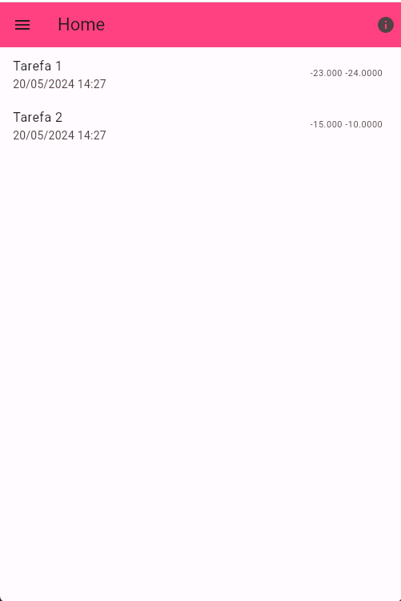
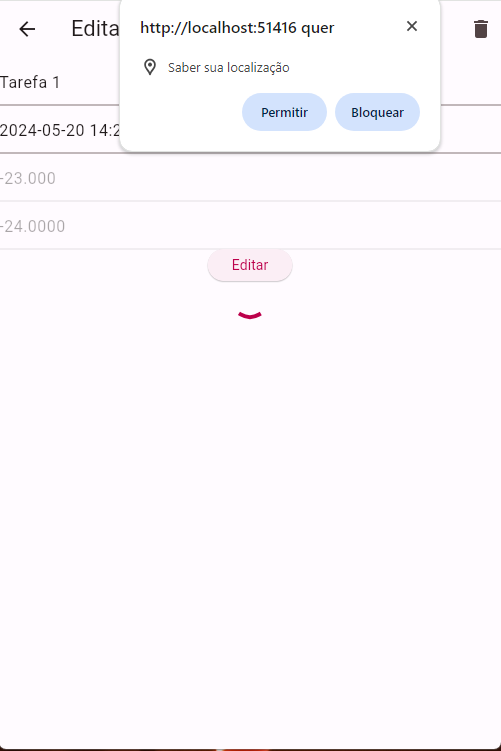
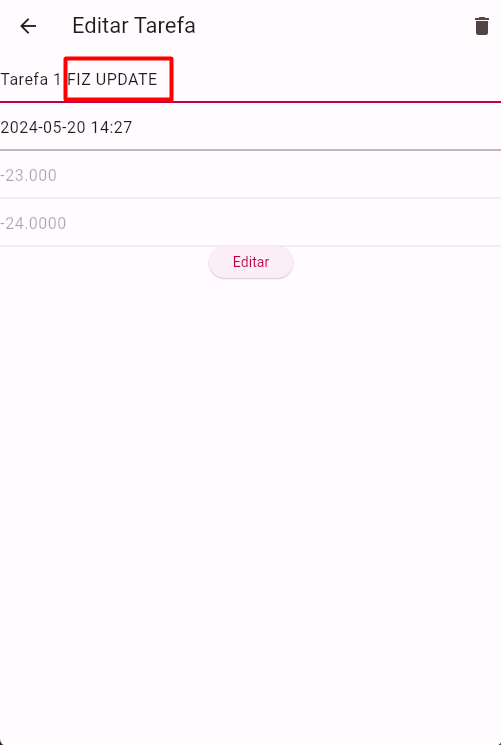
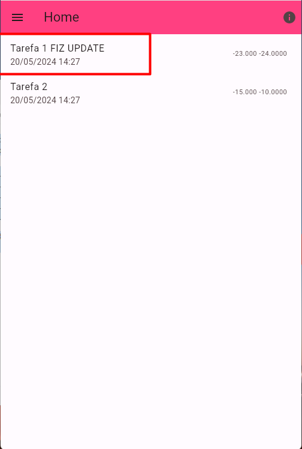
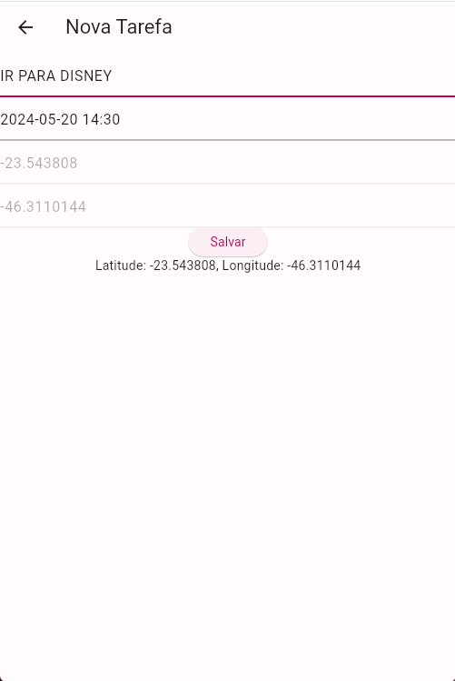
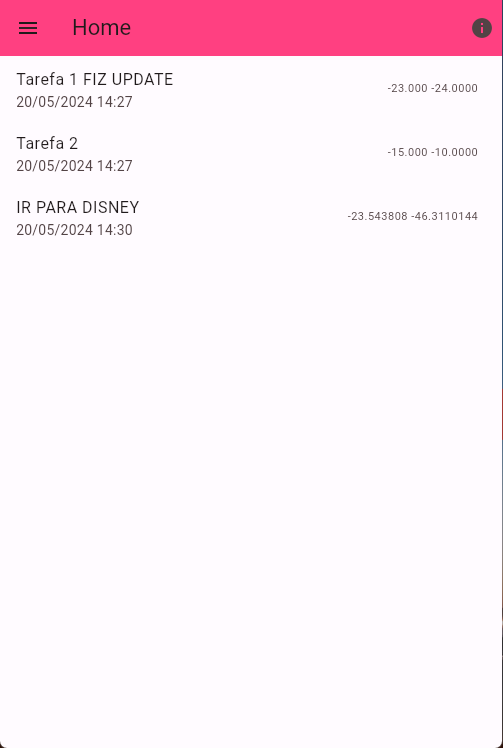
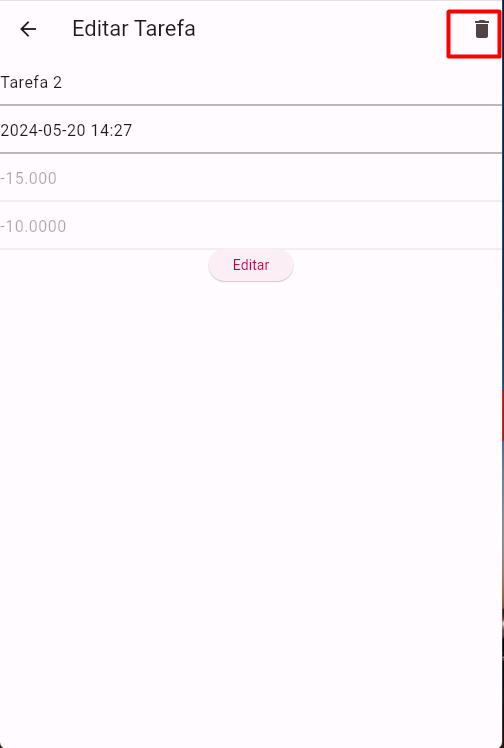
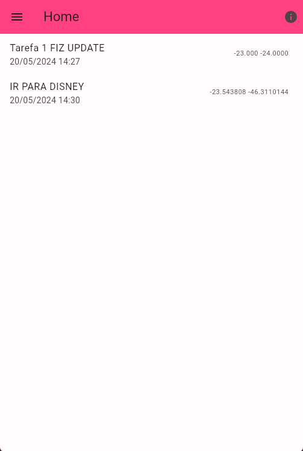

# Victor Pereira Aguiar

Disciplina: Desenvolvimento Mobile com Flutter [24E2_2]

## Prints do Funcionamento do aplicativo

Print tela HOME, inicial do aplicativo contendo a lista de tarefas

Print tela de EDITAR TAREFA

Print tela de EDITAR TAREFA 2

Print tela de HOME depois do UPDATE

Print tela de NOVA TAREFA

Print tela HOME após adicionar nova tarefa

Print tela EDITAR para apagar registro

Print tela HOME após apagar registro

